# Complete Authentik SSO Integration Guide with Flask

## Table of Contents
1. [Overview](#overview)
2. [Understanding the Technologies](#understanding-the-technologies)
3. [Authentication Flow](#authentication-flow)
4. [Project Architecture](#project-architecture)
5. [Prerequisites](#prerequisites)
6. [Step-by-Step Setup](#step-by-step-setup)
7. [Testing and Validation](#testing-and-validation)
8. [Troubleshooting](#troubleshooting)
9. [Security Best Practices](#security-best-practices)
10. [Advanced Configuration](#advanced-configuration)

## Overview

This guide demonstrates how to implement Single Sign-On (SSO) authentication using Authentik as an Identity Provider (IdP) with a Flask web application. The setup provides role-based access control, secure token-based authentication, and a modern SSO experience.

### What You'll Build
- A Flask web application with protected routes
- Authentik as the identity provider
- Role-based access control (Admin, Manager, User)
- Secure OIDC-based authentication flow
- Docker-containerized environment

## Understanding the Technologies

### OAuth 2.0
OAuth 2.0 is an authorization framework that enables applications to obtain limited access to user accounts. It works by delegating user authentication to the service that hosts the user account and authorizing third-party applications to access the user account.

**Key Components:**
- **Resource Owner**: The user who authorizes an application to access their account
- **Client**: The application that wants to access the user's account
- **Resource Server**: The server hosting the protected resources
- **Authorization Server**: The server issuing access tokens after successfully authenticating the resource owner

### OpenID Connect (OIDC)
OpenID Connect is an identity layer built on top of OAuth 2.0. While OAuth 2.0 is primarily about authorization, OIDC adds authentication capabilities.

**Key Features:**
- **ID Token**: A JWT containing identity information about the user
- **UserInfo Endpoint**: Provides additional user profile information
- **Standardized Claims**: Common user attributes like name, email, etc.
- **Discovery**: Automatic configuration discovery

### Authentik
Authentik is an open-source Identity Provider focused on flexibility and versatility. It can be used for:
- Single Sign-On (SSO)
- Multi-Factor Authentication (MFA)
- User provisioning and management
- Application proxy and authorization

**Key Benefits:**
- Modern web UI for administration
- Support for multiple protocols (OIDC, SAML, LDAP)
- Flexible policy engine
- Built-in application proxy
- Extensive customization options

## Authentication Flow

The following diagram illustrates how authentication works between the user, Flask application, and Authentik:

```mermaid
sequenceDiagram
    participant User as 👤 User
    participant App as 🐍 Flask App
    participant Authentik as 🔐 Authentik

    User->>App: 1. Visit protected page
    App->>App: 2. Check if logged in
    
    alt Not logged in
        App->>User: 3. Redirect to Authentik
        User->>Authentik: 4. Login with credentials
        Authentik->>User: 5. Redirect back to app with code
        User->>App: 6. Return with authorization code
        App->>Authentik: 7. Exchange code for tokens
        Authentik->>App: 8. Send access token & ID token
        App->>Authentik: 9. Fetch user info & roles
        Authentik->>App: 10. Send user profile + group memberships
        App->>User: 11. Show page (if user has permission)
    else Already logged in
        App->>User: 3. Show page (if user has permission)
    end
```



### Flow Breakdown

1. **Initial Request**: User attempts to access a protected resource
2. **Authentication Check**: Flask app checks for valid session
3. **Redirect to IdP**: If not authenticated, redirect to Authentik
4. **User Authentication**: User provides credentials to Authentik
5. **Authorization Code**: Authentik redirects back with authorization code
6. **Token Exchange**: Flask app exchanges code for access and ID tokens
7. **User Information**: Flask app fetches user profile and group memberships
8. **Access Control**: Flask app checks user roles against required permissions
9. **Resource Access**: If authorized, user gains access to the requested resource

## Project Architecture

### Directory Structure
```
authentik-flask-sso/
├── docker-compose.yml          # Container orchestration
├── .env                        # Environment variables
├── flask-app/                  # Flask application
│   ├── Dockerfile             # Flask container definition
│   ├── requirements.txt       # Python dependencies
│   └── app.py                 # Main Flask application
├── media/                     # Authentik media files
├── custom-templates/          # Custom Authentik templates
└── certs/                     # SSL certificates (if needed)
```

### Component Overview

**Flask Application (`app.py`)**:
- Handles HTTP requests and responses
- Manages user sessions
- Implements OIDC client functionality
- Enforces role-based access control

**Docker Compose**:
- PostgreSQL database for Authentik
- Redis for caching and sessions
- Authentik server and worker processes
- Flask application container

**Authentik Configuration**:
- OIDC provider configuration
- Application registration
- User and group management
- Flow and policy definitions

## Prerequisites

### Software Requirements
- Docker and Docker Compose
- Web browser for testing
- Text editor for configuration

### Knowledge Requirements
- Basic understanding of web authentication
- Familiarity with Docker containers
- Basic knowledge of Python/Flask (helpful but not required)

### System Requirements
- 4GB RAM minimum (8GB recommended)
- 2GB free disk space
- Network access for Docker image downloads

## Step-by-Step Setup

### Step 1: Clone the Repository

1. **Clone the GitHub repository:**
   ```bash
   git clone https://github.com/madiha-ahmed-chowdhury/Flask-application-with-SSO
   ```

2. **Verify the project structure:**
   ```bash
   ls -la
   ```
   You should see:
   - `docker-compose.yml` ✅ (already in repo)
   - `flask-app/` directory with Flask application files ✅ (already in repo)
   - Other directories like `media/`, `custom-templates/`, `certs/` ✅ (already in repo)

### Step 2: Create the Environment File

Since the `.env` file is not included in the repository (for security reasons), you need to create it:

1. **Create the `.env` file in the root directory:**
   ```bash
   touch .env
   ```

2. **Add the following content to `.env`:**
   ```bash
   # PostgreSQL Database Configuration
   PG_PASS=your-secure-database-password-change-this
   PG_USER=authentik
   PG_DB=authentik

   # Authentik Configuration
   AUTHENTIK_SECRET_KEY=this-is-your-secret-key-make-it-at-least-50-characters-long-and-random
   AUTHENTIK_ERROR_REPORTING__ENABLED=true

   # Flask Application (These will be updated later)
   AUTHENTIK_CLIENT_ID=placeholder-will-be-updated-from-authentik
   AUTHENTIK_CLIENT_SECRET=placeholder-will-be-updated-from-authentik
   AUTHENTIK_SERVER_URL=http://localhost:9000
   FLASK_SECRET_KEY=your-flask-secret-key-change-this-too

   # Optional: Authentik Image Configuration
   AUTHENTIK_IMAGE=ghcr.io/goauthentik/authentik
   AUTHENTIK_TAG=2024.2.2

   # Optional: Port Configuration
   COMPOSE_PORT_HTTP=9000
   COMPOSE_PORT_HTTPS=9443
   ```

3. **Generate secure passwords and keys:**
   ```bash
   # Generate a secure database password
   openssl rand -base64 32

   # Generate a secure Authentik secret key
   openssl rand -base64 60

   # Generate a secure Flask secret key
   openssl rand -base64 32
   ```

4. **Update the `.env` file with the generated values**

⚠️ **Security Note**: Never commit the `.env` file to version control as it contains sensitive credentials.

### Step 3: Start Authentik Services

1. **Start only Authentik services first (not the Flask app yet):**
   ```bash
   docker-compose up -d postgresql redis server worker
   ```

2. **Wait for services to be healthy (this may take 2-3 minutes):**
   ```bash
   docker-compose ps
   ```
   All services should show as "healthy" or "running"

3. **Check logs if there are any issues:**
   ```bash
   # Check server logs
   docker-compose logs -f server

   # Check all services
   docker-compose logs
   ```

### Step 4: Configure Authentik

1. **Access Authentik Web Interface:**
   - Open your browser and go to `http://localhost:9000`
   - You'll see the initial setup wizard

2. **Complete Initial Setup:**
   - Create admin account with a strong password
   - Set admin email address
   - Complete the welcome setup wizard

3. **Access Admin Interface:**
   - Go to `http://localhost:9000/if/admin/`
   - Login with your admin credentials
   - You should see the Authentik administration dashboard

### Step 5: Create User Groups in Authentik

Groups are used for role-based access control in the Flask application.

1. **Navigate to Directory → Groups**
2. **Create the following groups:**

   **Administrators Group:**
   - Name: `Administrators`
   - Add your admin user to this group

   **Managers Group:**
   - Name: `Managers`

   **Users Group:**
   - Name: `Users`

3. **Add your admin user to the Administrators group:**
   - Click on the `Administrators` group
   - Go to the "Users" tab
   - Add your admin user

### Step 6: Create OIDC Provider

This is the core configuration that enables OIDC authentication for your Flask app.

1. **Navigate to Applications → Providers**
2. **Click "Create"**
3. **Select "OAuth2/OpenID Provider"**
4. **Configure Provider with these settings:**

   **Basic Settings:**
   - **Name:** `flask-app-provider`
   - **Authorization flow:** `default-authorization-flow (Authorize application)`
   - **Client type:** `Confidential`
   - **Client ID:** Leave auto-generated (you'll copy this later)
   - **Client Secret:** Leave auto-generated (you'll copy this later)

   **URLs:**
   - **Redirect URIs:** `http://localhost:5000/callback`
   - **Scopes:** `openid profile email`

   **Token Settings:**
   - **Subject mode:** `Based on the User's hashed ID`
   - **Include claims in id_token:** ✅ (checked)
   - **Access token validity:** `minutes=10`
   - **Refresh token validity:** `days=30`

5. **Click "Create"**

6. **Copy the credentials:**
   - After creation, copy the `Client ID` and `Client Secret`
   - You'll need these for the Flask app configuration

### Step 7: Create Application in Authentik

1. **Navigate to Applications → Applications**
2. **Click "Create"**
3. **Configure Application:**
   - **Name:** `Flask SSO App`
   - **Slug:** `flask-app`
   - **Provider:** Select `flask-app-provider` (created in previous step)
   - **Launch URL:** `http://localhost:5000`
   - **Open in new tab:** ✅ (optional)

4. **Click "Create"**

### Step 8: Update Environment Configuration

Now update your `.env` file with the actual credentials from Authentik.

1. **Copy the Client ID and Secret:**
   - Go to Applications → Providers → flask-app-provider
   - Copy the `Client ID` and `Client Secret`

2. **Update your `.env` file:**
   ```bash
   # Replace the placeholder values with actual values from Authentik
   AUTHENTIK_CLIENT_ID=your-actual-client-id-from-authentik-provider
   AUTHENTIK_CLIENT_SECRET=your-actual-client-secret-from-authentik-provider
   ```

### Step 9: Start Flask Application

1. **Start the Flask application:**
   ```bash
   docker-compose up -d flask-app
   ```

2. **Verify all services are running:**
   ```bash
   docker-compose ps
   ```
   You should see all services (postgresql, redis, server, worker, flask-app) running

3. **Check Flask app logs:**
   ```bash
   docker-compose logs -f flask-app
   ```
   Look for "Running on http://0.0.0.0:5000" message